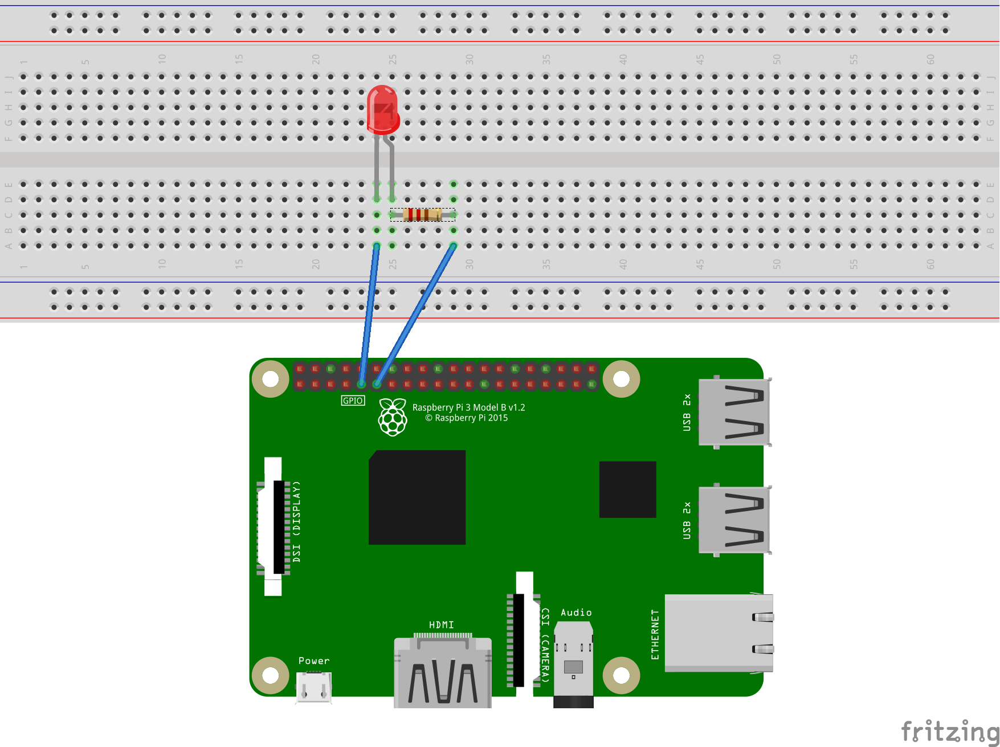

# Blinking led raspberry pi project with Dotnet Core and F#

This project is based on the excellent tutorial for [Remote debugging with VS Code on Windows to a Raspberry Pi using .NET Core on ARM](https://www.hanselman.com/blog/RemoteDebuggingWithVSCodeOnWindowsToARaspberryPiUsingNETCoreOnARM.aspx) created by Scott Hanselman. I just implemented the same code but using F#. Follow the instructions in the link above to setup the remote debugging environment. Then change the files publish.sh and .vscode/launch.json with the name of your raspberry pi. publish.sh assumes that the directory named /home/pi/Documents/Projects/fpitest exists in the raspberry pi.

Here are the components needed:
* Raspberry Pi 3 B/B+
* 220 ohms resistor
* Led 

Here is the wiring for the Raspberry Pi 3 B and the other components.

